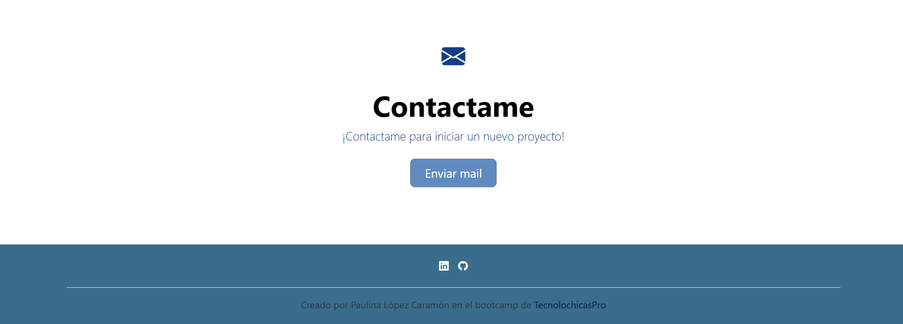

## Portafolio de proyectos
¡Hola! Soy **Paulina López Caramón**😊, estudio Ingeniería Industrial en la Universidad de las Américas Puebla. Recientemente me convertí en desarrolladora web Jr. gracias al bootcamp de Tecnolochicas Pro y este es uno de los proyectos que realicé😎. En este portafolio encontrarás información sobre mí. 

______
### El proyecto cuenta con las secciones de:

- ⚒️Habilidades.
- 📓Proyectos.
- 👩🏽Testimonios.
- 📲Contacto.

### Creado con:
- HTML.
- CSS.
- JavaScript.

    
    

### Vista previa

### ¡Espero saber de ti pronto!😊
**Correo:**
[paulcaramon@gmail.com](mailto:paulcaramon@gmail.com)

### Creado en el bootcamp de Tecnolochicas Pro ♥️
[Tecnolochicas](https://tecnolochicas.mx)